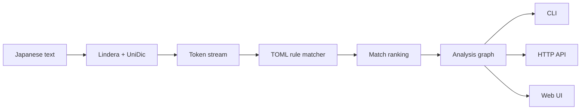

<div align="center">

# nnj-grammar

**Offline, deterministic Japanese grammar analysis**

[Live demo](https://nnj.alejoseed.com)


</div>

`nnj-grammar` identifies grammar constructions in Japanese text and shows how
they relate to the tokenized sentence. It uses Lindera with an embedded UniDic
dictionary and a TOML rule catalog; analysis requires no network access and
produces the same result for the same input.

## Quick start

```sh
cargo run -- "東京しか行かない"
```

The default terminal view draws the token chain with grammar matches beneath
it. Use another output format when you need structured data or lower-level
tokenizer details:

```sh
cargo run -- --output json "東京しか行かない"
cargo run -- --output tree "東京しか行かない"
cargo run -- --output table "食べている"
```

| Output | Description |
| --- | --- |
| `graph` | Token chain with grammar annotations; the default |
| `json` | Complete analysis document: tokens, matches, nodes, and edges |
| `tree` | Indented version of the hierarchy rendered by the web UI |
| `bunsetsu` | Deterministic 文/文節 structure derived from parts of speech |
| `bunsetsu-trace` | Chunking decisions and the rule behind each one |
| `table` | Surface form, reading, part of speech, conjugation, and lemma |
| `raw` | All 29 UniDic fields |
| `tokens` | Token JSON without grammar matching |
| `dot` | Graphviz DOT |

Run `cargo run -- --help` for the complete CLI interface, including file input
and custom grammar catalogs.

## How it works



The matcher is source-neutral. Token predicates, bounded slots, variants, and
left/right context are application behavior; grammar points are data. Catalog
labels such as `Noun` and `Verb` are compiled to UniDic predicates through
`grammar/compiler/hosts.json`, so changing catalogs does not require
catalog-specific branches in the matcher.

Release builds embed both UniDic and the default grammar catalog in the binary.

## Web app and API
You would need the frontend code first which you can find at:
[nnj-grammar-fe](github.com/alejoseed/nnj-grammar-fe)

Then, start the Rust API and Vite frontend together:

```sh
./dev.sh
```

Then open <http://localhost:5173>. To run the processes separately:

```sh
cargo run --bin nnj-grammar-server
mise exec node@26 -- npm --prefix web run dev
```

The server exposes `GET /api/health` and `POST /api/analyze` on
<http://127.0.0.1:7878>. It rejects non-loopback bind addresses unless
explicitly configured otherwise. Docker and logging options are covered in
[`RUNNING.md`](RUNNING.md).

## Grammar catalogs

The bundled catalog is generated from
[Hanabira Japanese Content](https://github.com/tristcoil/hanabira.org-japanese-content).
To rebuild it from a local Hanabira clone:

```sh
python3 tools/import_hanabira.py \
  /path/to/hanabira.org-japanese-content/grammar_json \
  grammar/hanabira
```

Local catalogs belong in the ignored `grammar/local/` directory and can be
selected explicitly:

```sh
cargo run -- --grammar-db grammar/local "東京しか行かない"
```

`tools/import_bunpro_local.py` can convert a user-saved Bunpro index payload
into a local catalog. It does not fetch data or accept account credentials.

## Development

```sh
cargo test
mise exec node@26 -- npm --prefix web install
mise exec node@26 -- npm --prefix web run build
mise exec node@26 -- npm --prefix web run test
mise exec node@26 -- npm --prefix web run test:browser
```

The main components are:

| Path | Responsibility |
| --- | --- |
| `src/tokenizer.rs` | Lindera and UniDic integration |
| `src/matcher.rs` | Grammar rule matching |
| `src/chunker.rs` | 文/文節 structure |
| `src/hierarchy.rs` | Analysis graph construction |
| `src/ranking.rs` | Match precedence |
| `src/server.rs` | Axum API |
| `grammar/` | Compiler metadata and generated catalogs |
| `web/` | TypeScript, Vite, and D3 interface |

## Attribution

The grammar catalog is derived from
[Hanabira Japanese Content](https://github.com/tristcoil/hanabira.org-japanese-content).
Morphological analysis uses [Lindera](https://github.com/lindera/lindera) and
UniDic. See [`THIRD_PARTY_NOTICES.md`](THIRD_PARTY_NOTICES.md) for licenses and
attribution.