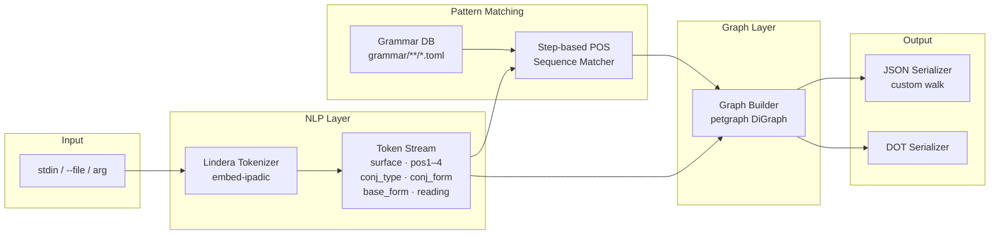

# feat: Japanese Grammar Pattern Graph Builder

## Summary

A Rust CLI tool (`nnj-grammar`) that tokenizes Japanese text using lindera (embedded IPADIC dictionary), matches token POS-tag sequences against a user-extensible TOML grammar pattern database, and emits a directed JSON graph annotating each morpheme and identified grammar construction. No LLM, no network, no runtime dependencies — a single binary. Targeted at Japanese learners who know vocabulary but miss grammar constructions.

---

## Problem Frame

Japanese learners with strong vocabulary often fail to understand sentences because an unfamiliar grammar construction changes the meaning entirely — e.g., `しか` requires a negative predicate and means "nothing but"; `〜ている` signals ongoing or resultant action vs. simple completion. Existing tools either rely on LLMs (slow, imprecise, non-portable, requires API key or large local model) or require heavy Python/Java runtimes (MeCab bindings, spaCy, GiNZA). A deterministic NLP pipeline — tokenize → POS-match → annotate → graph — can detect JLPT grammar constructions accurately, run in milliseconds on consumer hardware, and ship as a self-contained binary with no external dependencies.

---

## Requirements

| ID | Requirement |
|----|-------------|
| R1 | Accept Japanese text via positional CLI argument, `--file` flag, or stdin |
| R2 | Tokenize using lindera with embedded IPADIC — no system dependencies, single binary |
| R3 | Detect grammar constructions by matching token POS-tag sequences against TOML-defined pattern rules |
| R4 | Output a directed graph (JSON by default, DOT optional) with token nodes, pattern nodes, sequence edges, and pattern-member edges |
| R5 | Load grammar rule files from a configurable directory (default: `grammar/` relative to binary/CWD) |
| R6 | Compile to a single Rust binary with no runtime dependencies |
| R7 | Analyze a 200-word Japanese text in under 100ms on consumer hardware |
| R8 | Ship an initial grammar database covering common N5 constructions (CC-licensed Hanabira source) |

---

## Key Technical Decisions

### KTD1: lindera (`embed-ipadic`) over vibrato

lindera 3.0.7's `embed-ipadic` Cargo feature bakes the IPADIC dictionary into the binary at compile time — zero system dependencies, zero dictionary download, no runtime path configuration. Binary size increases ~70–100MB (mitigated by `lto = true` and `strip = true` in the release profile). vibrato is ~2x faster at tokenization but requires manually vendoring a `.dic` file and using `include_bytes!`. For a CLI tool (not a server processing millions of sentences), lindera's throughput is sufficient. Migrate to vibrato only if profiling shows tokenization is the bottleneck.

### KTD2: IPADIC over UniDic

IPADIC has 9 detail fields per token; UniDic has 29. Grammar pattern rules for JLPT-level detection use at most 5 fields: POS1, POS2, conjugation type, conjugation form, and surface/base form. IPADIC is better documented in English, simpler to reason about for rule authoring, and reduces cognitive overhead when manually encoding grammar patterns. UniDic's additional fields (prosodic info, lemma IDs) are not needed for this use case.

### KTD3: TOML rule files over compiled-in rules

Grammar rules load from `*.toml` files at startup, not compiled into the binary. This lets users add N4–N1 patterns, adjust existing rules, or swap grammar databases without recompiling. The grammar/ directory ships with N5 patterns; additional files sit alongside. The format is human-readable and git-diff-friendly.

### KTD4: Step-based POS sequence matcher with wildcard gaps

Each grammar pattern is a sequence of "steps." Each step matches one token by any combination of: surface form, POS1, POS2, conjugation form, or base form. Steps can also be wildcards that consume 0–N arbitrary tokens. This handles both adjacent constructions (`〜ている`: te-form verb immediately followed by `いる`) and span constructions (`しか〜ない`: `しか` particle followed eventually by `ない` auxiliary with up to N tokens between). A regex engine over token streams is not used — the step-based scanner is simpler and directly expresses JLPT grammar pattern structure.

### KTD5: Custom JSON serializer over petgraph native serde

petgraph's built-in serde output uses opaque numeric node IDs and a schema unfriendly to downstream consumers (D3, Gephi, Cytoscape, custom renderers). The plan specifies a custom serializer that walks `graph.node_indices()` and `graph.edge_indices()` to produce a `{ input, nodes, edges }` shape where each node carries its full data and each edge references node IDs explicitly. petgraph remains the internal data structure; only output is custom.

### KTD6: Hanabira (CC) as seed database; Bunpro as personal-use augmentation only

Hanabira.org's Japanese content repo (CC with attribution) provides JSON grammar files for N5–N1 that can be legally bundled and redistributed. These will be manually adapted into the TOML step format for the initial N5 database. Bunpro (~900 patterns, richest detail) may be self-extracted via the `_next/data` endpoint for personal augmentation but **must not be redistributed** per Bunpro's ToS. Only Hanabira-sourced content ships in the binary.

---

## High-Level Technical Design



**Graph node and edge types:**

```
NodeKind
  Token(TokenNode)    — one per morpheme from lindera
  Pattern(PatternNode)— one per matched grammar construction instance

EdgeKind
  Sequence     — token[i] → token[i+1], the linear sentence spine
  PatternSpan  — first token of match → pattern node
  PatternEnd   — last token of match → pattern node
```

**Example — `ゴミしか捨てない`:**

```
[ゴミ:名詞] --Sequence--> [しか:助詞-副助詞] --Sequence--> [捨て:動詞] --Sequence--> [ない:助動詞]
                               |                                                         |
                           PatternSpan                                              PatternEnd
                               ↓_________________________Pattern________________________↑
                                             [しか〜ない: "only; nothing but"]
```

**IPADIC detail field index reference (both lindera and vibrato use the same schema):**

| Index | Field | Example values |
|-------|-------|----------------|
| 0 | POS1 (品詞) | 名詞, 動詞, 助詞, 助動詞, 形容詞 |
| 1 | POS2 (品詞細分類1) | 格助詞, 副助詞, 係助詞, 接続助詞 |
| 2 | POS3 (品詞細分類2) | — |
| 3 | POS4 (品詞細分類3) | — |
| 4 | Conjugation type | 五段・カ行促音便, 一段, * |
| 5 | Conjugation form | 基本形, 連用テ接続, 未然形, 連用形 |
| 6 | Base form (原形) | 行く, いる, ない |
| 7 | Reading (読み) | トウキョウ, シカ |
| 8 | Pronunciation | — |

**Pattern rule TOML schema (directional — not implementation specification):**

```toml
[[patterns]]
id        = "shika-nai"
name      = "しか〜ない"
jlpt      = "N5"
meaning_en = "only; nothing but (predicate must be negative)"
hint       = "The predicate at the end of the clause must be in negative form."

[[patterns.steps]]
surface = "しか"
pos1    = "助詞"
pos2    = "副助詞"

[[patterns.steps]]
wildcard = { min = 0, max = 8 }

[[patterns.steps]]
surface = "ない"
pos1    = "助動詞"
```

---

## Output Structure

```
nnj-grammar/
├── Cargo.toml
├── src/
│   ├── main.rs                  # entry point, pipeline orchestration
│   ├── cli.rs                   # clap argument definitions
│   ├── tokenizer.rs             # lindera wrapper, Token struct
│   ├── patterns/
│   │   ├── mod.rs
│   │   ├── rule.rs              # PatternRule, Step, WildcardStep types
│   │   └── loader.rs            # TOML deserialization, grammar DB directory walk
│   ├── matcher.rs               # step-based POS sequence matching engine
│   └── graph/
│       ├── mod.rs
│       ├── builder.rs           # DiGraph<NodeKind, EdgeKind> construction
│       └── output.rs            # JSON and DOT serializers
├── grammar/
│   └── n5/
│       ├── particles.toml       # は, が, を, に, で, へ, と
│       ├── verb_forms.toml      # ている, てから, てください
│       └── expressions.toml     # しか, だけ, まで, から, ばかり
└── tests/
    ├── tokenizer_tests.rs
    ├── matcher_tests.rs
    ├── graph_tests.rs
    └── integration_tests.rs
```

---

## Scope Boundaries

### In Scope
- Morphological tokenization via lindera IPADIC
- POS-sequence grammar pattern detection
- JSON and DOT graph output
- TOML grammar rule format and directory loader
- N5 grammar pattern database (Hanabira CC-licensed content)
- Single compiled Rust binary CLI

### Deferred to Follow-Up Work
- N4–N1 grammar databases (same code, content-only effort)
- Bunpro sync / import tooling (personal use, not distributable)
- Batch file processing mode (multiple inputs in one invocation)
- WASM build target for browser use
- Pattern confidence scoring or overlapping-match disambiguation

### Out of Scope
- Syntactic dependency parsing (subject/object/predicate relations)
- LLM-based analysis of any kind
- Custom model training
- GUI, web service, or integrated visualizer (external tools handle rendering)

---

## Open Questions

| Question | Status |
|----------|--------|
| Should unknown/gairaigo tokens (カタカナ words not in IPADIC) appear in the graph with partial POS data or be filtered? | Defer to implementation — test with representative foreign-word sentences |
| Should the step matcher prefer the longest match or return all overlapping matches? | Default to all matches; longest-match preference is a future flag |
| Is `grammar/` resolved relative to the binary location or CWD? | Implement CWD first (simpler); binary-relative is a follow-up |

---

## Implementation Units

### U1. Project setup and CLI skeleton

**Goal:** Initialize the Cargo project with all dependencies, release profile config, and a working binary that accepts text input and exits cleanly.

**Requirements:** R1, R6

**Dependencies:** none

**Files:**
- `Cargo.toml`
- `src/main.rs`
- `src/cli.rs`

**Approach:** `cargo init`, then add to `Cargo.toml`: `lindera = { version = "3.0.0", features = ["embed-ipadic"] }`, `petgraph = { version = "0.8", features = ["serde-1"] }`, `serde = { version = "1.0", features = ["derive"] }`, `serde_json = "1.0"`, `clap = { version = "4", features = ["derive"] }`, `toml = "0.8"`, `walkdir = "2"`. Release profile: `lto = true`, `strip = true`, `opt-level = 3`. Define CLI with clap derive: positional `text: Option<String>`, `--file/-f <PATH>`, `--output/-o <FORMAT>` (json|dot, default json), `--grammar-db <PATH>` (default "grammar").

**Test scenarios:**
- `cargo build --release` succeeds and produces a binary at `target/release/nnj-grammar`
- `nnj-grammar --help` exits 0 and prints all flags with descriptions
- `nnj-grammar --version` prints the version string from Cargo.toml
- `echo "テスト" | nnj-grammar` runs without panic (stub output is acceptable at this stage)
- `nnj-grammar "テスト"` runs without panic
- Test expectation: no unit tests for CLI scaffolding; integration smoke only

**Verification:** `cargo build --release && ./target/release/nnj-grammar --help` exits 0.

---

### U2. Tokenizer integration

**Goal:** Wrap lindera into a clean `tokenize()` function returning a `Vec<Token>` with all IPADIC fields extracted and typed.

**Requirements:** R2, R7

**Dependencies:** U1

**Files:**
- `src/tokenizer.rs`
- `tests/tokenizer_tests.rs`

**Approach:** Define `pub struct Token` with fields: `surface: String`, `pos1: String`, `pos2: String`, `pos3: String`, `pos4: String`, `conj_type: String`, `conj_form: String`, `base_form: String`, `reading: String`, `byte_start: usize`, `byte_end: usize`, `position: usize`. Implement `pub fn tokenize(text: &str) -> anyhow::Result<Vec<Token>>`. Build the lindera `Tokenizer` once at module init (or pass it as a parameter to avoid repeated construction). Map `token.details()` indices 0–8 to struct fields; treat `"*"` values as empty string. Derive `Serialize`, `Deserialize`, `Debug`, `Clone` on `Token`.

**Patterns to follow:** lindera 3.x: `load_dictionary("embedded://ipadic")`, `Segmenter::new(Mode::Normal, dict, None)`, `Tokenizer::new(segmenter)`.

**Test scenarios:**
- `tokenize("東京に行く")` → 3 tokens with: `東京` (pos1="名詞"), `に` (pos1="助詞", pos2="格助詞"), `行く` (pos1="動詞", conj_form="基本形")
- `tokenize("ゴミしか捨てない")` → `しか` has pos2="副助詞"; `ない` has pos1="助動詞"
- `tokenize("")` → empty `Vec<Token>`, no error
- `tokenize("hello world")` → tokens returned for unknown words without panic
- Byte positions on all tokens are non-overlapping and cover the full input span
- 200-word text (≥1000 chars) tokenizes in under 50ms (manual timing or criterion benchmark)

**Verification:** `cargo test tokenizer` passes.

---

### U3. Grammar pattern rule format and loader

**Goal:** Define the TOML rule schema, implement a directory-walking loader, and populate the N5 grammar database.

**Requirements:** R3, R5, R8

**Dependencies:** U1

**Files:**
- `src/patterns/rule.rs`
- `src/patterns/loader.rs`
- `src/patterns/mod.rs`
- `grammar/n5/particles.toml`
- `grammar/n5/verb_forms.toml`
- `grammar/n5/expressions.toml`

**Approach:** Define serde-deserializable types:

```
PatternRule { id, name, jlpt, meaning_en, hint: Option<String>, steps: Vec<Step> }
Step { surface: Option<String>, pos1: Option<String>, pos2: Option<String>,
       conj_form: Option<String>, base_form: Option<String>,
       wildcard: Option<WildcardStep> }
WildcardStep { min: usize, max: usize }
```

A step with `wildcard` set matches 0..=max arbitrary tokens and ignores all other fields. A step without `wildcard` matches a single token where all specified fields equal the token's values (unspecified fields match anything).

Loader: walk `*.toml` files in the grammar DB directory recursively using `walkdir`. Each file is expected to have a top-level `patterns` array. Deserialize each file; on error, emit a `eprintln!` warning and continue. Return `Vec<PatternRule>`.

N5 TOML content: manually encode at minimum these patterns from Hanabira N5 — は (topic, 係助詞), が (subject, 格助詞), を (object, 格助詞), に (location/direction, 格助詞), で (location-of-action, 格助詞), から (from/because, 格助詞 or 接続助詞), まで (until/to, 副助詞), しか (only; hint: negative predicate required), だけ (only/just, 副助詞), ている (ongoing action — te-form verb + いる), てから (after doing — te-form verb + から), てください (please do — te-form verb + ください).

**Test scenarios:**
- Loading `grammar/n5/` returns ≥ 12 `PatternRule` structs without error
- The `しか` rule has `jlpt = "N5"`, steps containing `{ surface = "しか", pos2 = "副助詞" }`, and a non-empty `hint`
- Loading a directory containing a malformed TOML file emits a warning to stderr and loads remaining files
- Loading a nonexistent directory returns an `Err` with a descriptive message
- `PatternRule` with `steps = []` deserializes without panic
- `WildcardStep { min=0, max=5 }` deserializes correctly from `wildcard = { min = 0, max = 5 }`

**Verification:** `cargo test patterns` passes; loading `grammar/n5/` returns ≥ 12 rules.

---

### U4. Pattern matching engine

**Goal:** Given a token stream and loaded pattern rules, find all grammar construction matches and return them as annotated spans.

**Requirements:** R3

**Dependencies:** U2, U3

**Files:**
- `src/matcher.rs`
- `tests/matcher_tests.rs`

**Approach:** Define `pub struct PatternMatch { pub rule_id: String, pub rule_name: String, pub jlpt: String, pub meaning_en: String, pub hint: Option<String>, pub token_start: usize, pub token_end: usize }`.

For each rule, run a sliding-window scan: try to start matching the rule's steps at each token position `i`. Advance through steps, consuming tokens. A non-wildcard step must match the current token's fields exactly (all specified fields equal). A wildcard step greedily tries 0..=max tokens. If all steps are consumed, record a `PatternMatch` at `[token_start, token_end]`. Allow overlapping matches across different rules. Sort result by `token_start`. Return `Vec<PatternMatch>`.

**Test scenarios:**
- `"食べている"` → matches `ている` pattern (te-form verb → `いる`)
- `"東京しか行かない"` → matches `しか` at position of the `しか` token
- `"学校から家まで"` → matches `から` AND `まで` patterns, both returned, sorted by token position
- Sentence with no matching patterns → empty `Vec`, no panic
- `"ゴミしか捨てない"` → `しか〜ない` wildcard span match (if encoded) finds `しか` at start and `ない` at end
- Two patterns matching at the same token position (e.g., `から` matches as both particle and conjunction) → both returned
- Pattern starting at token index 0 matches correctly
- Pattern ending at the last token matches correctly
- A rule with only wildcard steps does not infinite-loop

**Verification:** `cargo test matcher` passes; the `ている` and `しか` tests both pass.

---

### U5. Graph data structures

**Goal:** Define the typed node and edge enums used in the DiGraph and verify they serialize correctly.

**Requirements:** R4

**Dependencies:** U1, U2

**Files:**
- `src/graph/mod.rs`
- `src/graph/builder.rs` (type definitions only; construction logic in U6)

**Approach:**

```
pub enum NodeKind { Token(TokenNode), Pattern(PatternNode) }

pub struct TokenNode {
    id: usize, surface, pos1, pos2, pos3, pos4,
    conj_type, conj_form, base_form, reading,
    byte_start, byte_end,
}

pub struct PatternNode {
    id: usize, name, jlpt, meaning_en, hint: Option<String>,
    token_start: usize, token_end: usize,
}

pub enum EdgeKind { Sequence, PatternSpan, PatternEnd }
```

Use `petgraph::graph::DiGraph<NodeKind, EdgeKind>` as the internal type alias exported from `graph::mod`. Derive `Serialize`, `Deserialize`, `Debug`, `Clone` on all types.

**Test scenarios:**
- `TokenNode` serializes to JSON with all fields present (no missing keys)
- `PatternNode` serializes to JSON with `name`, `jlpt`, `meaning_en`, `token_start`, `token_end`
- A `DiGraph<NodeKind, EdgeKind>` with 2 token nodes and 1 sequence edge serializes to valid JSON via petgraph's serde-1
- `serde_json::from_str` on the serialized graph deserializes back without error

**Verification:** `cargo test graph_structs` passes.

---

### U6. Graph builder

**Goal:** Assemble a complete `DiGraph` from a token stream and its pattern matches.

**Requirements:** R4

**Dependencies:** U4, U5

**Files:**
- `src/graph/builder.rs`
- `tests/graph_tests.rs`

**Approach:** Implement `pub fn build_graph(tokens: &[Token], matches: &[PatternMatch]) -> DiGraph<NodeKind, EdgeKind>`. Steps:
1. Add one `NodeKind::Token(TokenNode)` per token in order; collect `NodeIndex` values in a `Vec<NodeIndex>` indexed by token position.
2. Add `EdgeKind::Sequence` from `node_indices[i]` to `node_indices[i+1]` for each adjacent pair.
3. For each `PatternMatch`: add one `NodeKind::Pattern(PatternNode)` node; add `EdgeKind::PatternSpan` from `node_indices[match.token_start]` to the pattern node; add `EdgeKind::PatternEnd` from `node_indices[match.token_end]` to the pattern node.

**Test scenarios:**
- 3-token sentence, no matches → 3 token nodes, 2 sequence edges, 0 pattern nodes
- 4-token sentence, 1 match spanning tokens 1–3 → 5 nodes total, 3 sequence edges, 2 pattern edges
- Match spanning tokens 0–3 in a 5-token sentence → pattern span/end edges reference correct `NodeIndex` values
- Two non-overlapping matches → 2 pattern nodes, correct edge counts
- Two overlapping matches sharing a token → both pattern nodes present; shared token has multiple outgoing edges
- Empty token list → empty graph, no panic
- `graph.edge_count()` equals `(token_count - 1) + (2 * match_count)` for non-overlapping cases

**Verification:** `cargo test graph_builder` passes.

---

### U7. Output serializers

**Goal:** Serialize the DiGraph to a user-friendly JSON shape and to DOT format.

**Requirements:** R4

**Dependencies:** U6

**Files:**
- `src/graph/output.rs`

**Approach:**

**JSON** — implement `pub fn to_json(graph: &DiGraph<NodeKind, EdgeKind>, input: &str) -> serde_json::Value` by walking `graph.node_indices()` and `graph.edge_indices()`:

```json
{
  "input": "ゴミしか捨てない",
  "nodes": [
    { "id": 0, "type": "token",   "surface": "ゴミ", "pos1": "名詞", ... },
    { "id": 4, "type": "pattern", "name": "しか",   "jlpt": "N5", ... }
  ],
  "edges": [
    { "source": 0, "target": 1, "type": "sequence"     },
    { "source": 1, "target": 4, "type": "pattern_span" },
    { "source": 3, "target": 4, "type": "pattern_end"  }
  ]
}
```

Node `id` values are the `u32` value of the `NodeIndex`. Do not use petgraph's native serde output — build the JSON manually for a clean consumer-friendly schema.

**DOT** — implement `pub fn to_dot(graph: &DiGraph<NodeKind, EdgeKind>) -> String`. Token nodes labeled with `surface`; pattern nodes labeled with `name (jlpt)`. Edge labels: "seq", "span", "end". Use `petgraph::dot::Dot` as a starting point or write a manual walker if label control is insufficient.

**Test scenarios:**
- `to_json` on a 3-token graph with no patterns returns valid JSON with `nodes` length 3 and `edges` length 2
- Every node in `nodes` has an `id` and a `type` field
- Every edge in `edges` has `source`, `target`, and `type` fields
- Token node JSON includes `surface` and `pos1`
- Pattern node JSON includes `name` and `jlpt`
- `serde_json::from_value::<serde_json::Value>(to_json(...))` succeeds
- `to_dot` on a 2-token graph returns a string starting with `digraph {` and ending with `}`

**Verification:** `cargo test output` passes.

---

### U8. End-to-end wiring and integration tests

**Goal:** Wire CLI flags through the full pipeline and verify the complete flow on representative Japanese sentences.

**Requirements:** R1–R8

**Dependencies:** U1–U7

**Files:**
- `src/main.rs` (complete wiring)
- `tests/integration_tests.rs`

**Approach:** In `main.rs`: parse args with clap; load grammar DB from `--grammar-db` (default `"grammar"`); read text from positional arg, then `--file`, then stdin; call `tokenize()`, then `match_patterns()`, then `build_graph()`, then serialize per `--output`; write to stdout. Errors: missing or unreadable grammar DB → stderr + exit 1; empty input → write empty-nodes JSON + exit 0; tokenizer error → stderr + exit 1.

**Test scenarios:**
- `nnj-grammar "東京しか行かない"` → JSON output includes a node with `name = "しか"`
- `nnj-grammar "食べている"` → JSON output includes a node with `name = "ている"`
- `nnj-grammar "これはペンです"` → JSON output includes a node with `name = "は"`
- `nnj-grammar --output dot "東京に行く"` → output starts with `digraph {`
- `echo "テスト" | nnj-grammar` → valid JSON output, no panic
- `nnj-grammar --file /tmp/nonexistent.txt` → exits 1, stderr contains "file" or "not found"
- `nnj-grammar --grammar-db /tmp/empty-nonexistent "テスト"` → exits 1 with grammar DB error message
- `nnj-grammar ""` → exits 0 with `{ "input": "", "nodes": [], "edges": [] }`
- Release binary is present at `target/release/nnj-grammar`

**Verification:** `cargo test --test integration_tests` passes against the bundled `grammar/n5/` database.

---

## Risks & Dependencies

| Risk | Severity | Mitigation |
|------|----------|------------|
| lindera IPADIC binary size (~100MB release) | Medium | `lto=true, strip=true` reduces significantly; document expected size in README |
| Grammar pattern encoding is ongoing content work | High | N5 only for MVP (≤30 patterns); POS step encoding is manual but mechanical; N4–N1 is follow-up |
| IPADIC tokenizes some compound words unexpectedly | Low | Test with representative sentences; document known edge cases in grammar TOML comments |
| Bunpro ToS prohibits redistribution | High | Only Hanabira (CC) content ships with the binary; Bunpro is personal-use augmentation, never committed |
| Overlapping patterns produce noisy graphs for complex sentences | Low | All matches returned by default; disambiguation is a future flag |
| lindera 3.x API differs from 2.x examples found online | Low | Pin to `lindera = "3.0.0"`; reference docs.rs/lindera/3.0.7 specifically |

---

## Sources & Research

- lindera 3.0.7: [docs.rs/lindera](https://docs.rs/lindera/3.0.7/lindera/) — embed-ipadic feature, Token struct, details() index layout
- vibrato 0.5.2: [github.com/daac-tools/vibrato](https://github.com/daac-tools/vibrato) — speed comparison reference; ~2x faster than lindera, manual dict embedding
- petgraph 0.8 (serde-1): [docs.rs/petgraph](https://docs.rs/petgraph) — DiGraph, NodeIndex, serde serialization shape
- serde / serde_json 1.x: [serde.rs/derive](https://serde.rs/derive.html) — derive macros, rename attributes
- Hanabira Japanese content (CC, primary grammar source): [github.com/tristcoil/hanabira.org-japanese-content](https://github.com/tristcoil/hanabira.org-japanese-content)
- Bunpro (personal-use augmentation only): [bunpro.jp](https://bunpro.jp) — `_next/data` endpoint documents pattern structure fields
- nlprule (structural analogy for POS-sequence rule format): [github.com/bminixhofer/nlprule](https://github.com/bminixhofer/nlprule)
- JLPTsensei complete grammar list (cross-reference): [jlptsensei.com/complete-jlpt-grammar-list](https://jlptsensei.com/complete-jlpt-grammar-list/)
